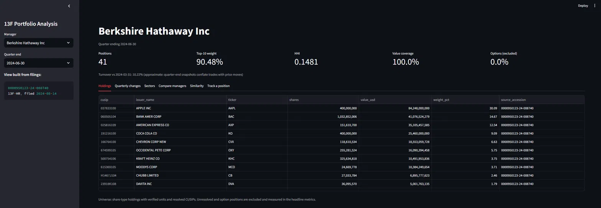
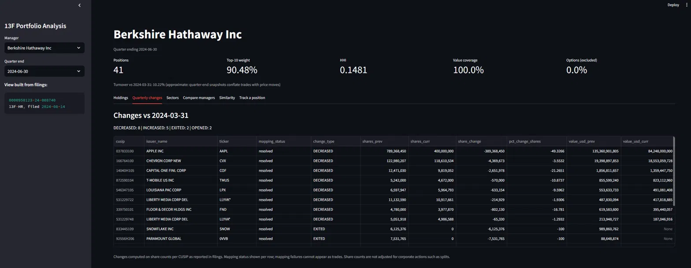
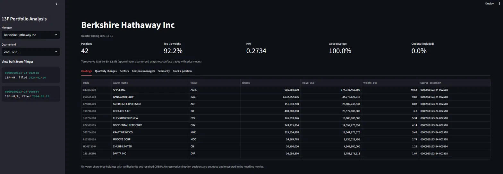
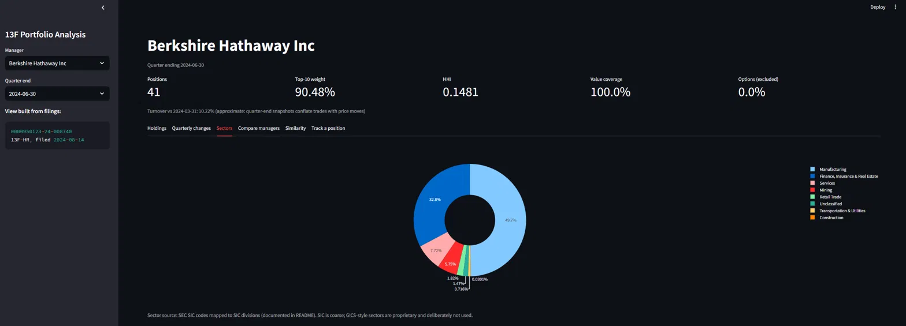
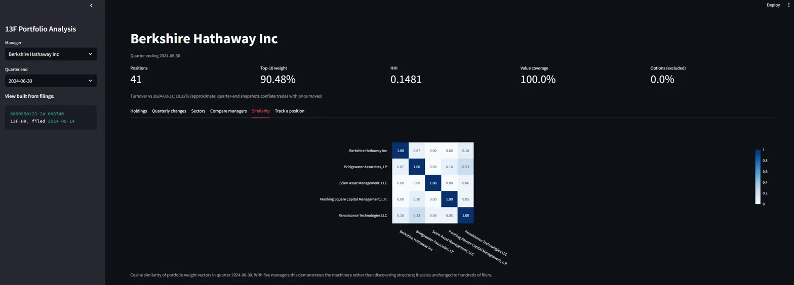
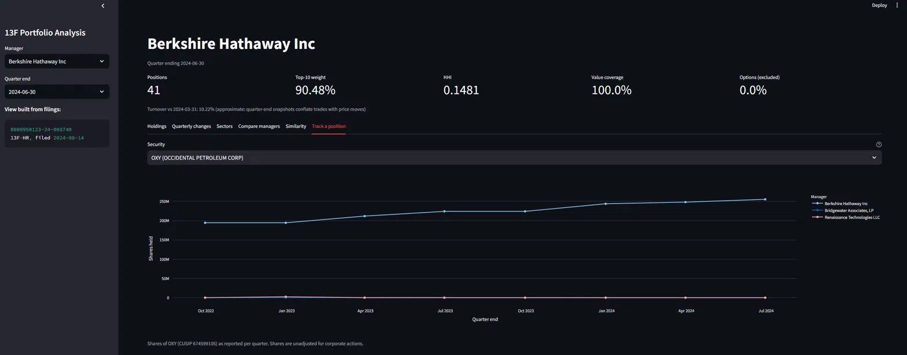

# 13F Portfolio Analysis

Reconstructs institutional investment portfolios from raw SEC 13F filings,
tracks how they change quarter over quarter, and serves the results in a
dashboard where every number is traceable to the filing that produced it.

Built from primary sources end to end: raw EDGAR filings are fetched,
archived byte-for-byte, parsed, verified, and normalized by this codebase.
No 13F datasets or 13F-specific libraries are used.

## What it answers

For any tracked manager: what do they own, what did they buy and sell last
quarter, how concentrated is their book, how does it split by sector, and
how much does it overlap with another manager's. Bonus analytics cluster
managers by holdings similarity and track a single security across all
filers over time.

## Results on the shipped configuration

Five managers (Berkshire Hathaway, Bridgewater, Scion, Pershing Square,
Renaissance Technologies), eight quarters (Q3 2022 through Q2 2024),
deliberately straddling the SEC's value-unit change at the end of 2022.

| Metric | Value |
|---|---|
| Filings ingested | 44 (including 4 amendments) |
| Parse coverage | 100.0% (44/44) |
| Holdings rows parsed | 37,959 |
| CUSIP resolution, by distinct security | 85.03% (5,349/6,291) |
| CUSIP resolution, by portfolio value | 99.68% |
| Sector classification, by value | 96.1% |

All figures are produced by the code (`parse_coverage`,
`resolution_rate`, `sector_coverage`) and reproduce from a clean clone.
Unresolved securities and option positions are excluded from analysis
visibly, with their share of book value measured and displayed, never
silently dropped.

### Quarter-over-quarter changes, from primary filings

Berkshire's Q2 2024: the halving of the Apple stake, new positions in Ulta
and Heico, every change computed from share counts per CUSIP and traceable
to its accession number.

### Amendments composed correctly

Berkshire's Q4 2023 view is built from two filings: the original plus the
NEW HOLDINGS amendment that revealed the Chubb position previously omitted
under confidential treatment. The Chubb row carries the amendment's
accession number; everything else carries the original's.

### Sector allocation

Sector split from SEC SIC codes, with the unclassified remainder visible
rather than dropped.

### Cross-manager analytics

Cosine similarity across manager weight vectors, and Berkshire's Occidental
accumulation tracked across eight quarters of filings.

## Setup

Requires Python 3.10+ and Git Bash or PowerShell on Windows (the
scheduler is Windows-specific; everything else is portable).

    git clone https://github.com/salkooheji/13f-portfolio-analysis.git
    cd 13f-portfolio-analysis
    python -m venv .venv
    source .venv/Scripts/activate        # PowerShell: .venv\Scripts\Activate.ps1
    pip install -r requirements.txt
    pip install -e .

Edit `config.yaml` and set `sec_user_agent` to your own name and email.
The SEC requires an identifying User-Agent on automated requests; this is
a fair-access policy header, not a registration.

Then:

    python run_pipeline.py

First run fetches roughly 44 filings and takes a few minutes, dominated
by polite rate-limiting. CUSIP resolution uses OpenFIGI's free API; an
optional free API key (`export OPENFIGI_API_KEY=...`) raises its batch
limits and turns the one-time bulk resolution from ~30 minutes into ~2.
Subsequent runs only process new filings and take seconds.

Dashboard:

    streamlit run dashboard/app.py

Tests:

    python -m pytest tests/

Scheduled runs (optional): `scheduler/register_task.ps1` registers a
weekly Windows Task Scheduler job (Mondays 07:00, runs missed jobs at
next boot). Remove with
`Unregister-ScheduledTask -TaskName "13F-Portfolio-Pipeline"`.
Scheduled runs execute keyless by design; the OpenFIGI key is only an
accelerator for bulk backfills.

## Design decisions and why

**Holdings belong to filings, never to quarters.** Every filing is an
immutable record keyed by accession number; amendments become new rows
linked by a `supersedes` pointer. "What did this manager hold?" is a
query that chooses which filings to read: originals only for the
point-in-time view, or latest amendments for the restated view. Nothing
is ever overwritten.

**Amendment policy.** A `RESTATEMENT` amendment replaces the original
filing for its quarter; a `NEW HOLDINGS` amendment adds to it. Both
occur in the shipped data: Berkshire's Q3 2023 has one of each, and the
Q4 2023 `NEW HOLDINGS` amendment is the famous reveal of the Chubb
position previously omitted under confidential treatment, which the
pipeline detects via the cover page's confidential-treatment flag.

**Value units are verified per filing, not assumed.** 13F values were
reported in thousands of dollars for decades; the SEC switched to whole
dollars for filings submitted from early 2023. Rather than hard-coding
the boundary, each filing's units are inferred from its own implied
share prices (median of value/shares under both hypotheses; the
plausibility range spans less than the 1000x hypothesis gap, so at most
one hypothesis can pass). This mattered: Renaissance Technologies kept
filing in thousands well into 2024, and a hard-coded cutover would have
understated every RenTech book by 1000x. Filings that fail verification
are excluded loudly rather than guessed at.

**Diffs are computed on CUSIPs, then mapped for display.** Quarterly
changes compare share counts per CUSIP as reported in the filings.
Ticker mapping is joined afterward, for display only, so a CUSIP that
fails to resolve can never masquerade as a trade. Changes are detected
on share counts, not values, because values move with prices even when
nothing was traded. Both properties are enforced by tests.

**Options are excluded from equity analysis, and measured.** 13F option
positions (putCall field) report underlying notional, which is not
comparable to equity value. They are excluded from share-based analysis
and their share of raw book value is displayed. Scion's Q2 2023 filing
is the showcase: 93.6% of reported value was put notional, and treating
it as long equity would have inverted the portfolio's meaning.

**CUSIP resolution uses a documented strategy funnel.** Strict OpenFIGI
CUSIP lookup against US listings first; then CINS lookup for
letter-prefixed international identifiers (Chubb, Aon, Nu Holdings);
then exchange-unconstrained retries that recover delisted names
(Activision). Every resolved row records the strategy that found it.
The unresolved remainder is dominated by identifiers that are stale or
misprinted in the filings themselves (e.g. a filer reporting Nu
Holdings under a CUSIP one digit off from the valid one).

**Sectors come from SEC SIC codes.** Ticker to CIK via the SEC's
company_tickers.json, CIK to SIC via the submissions API, SIC to its
published division. Fully documented and free; deliberately not
GICS-style sectors, which are proprietary. The trade-off is coarseness:
SIC classifies Apple under Manufacturing.

**Idempotency is layered.** The fetcher skips accession numbers already
recorded, with the primary key as a structural backstop; parsing is
gated by per-filing status; resolution and sector mapping are cached by
identifier; the fallback funnel marks exhausted attempts so repeat runs
never re-query known-dead identifiers. Running the pipeline twice
changes nothing, downloads nothing, and completes in seconds.

## Known limitations

- 13F covers only long US equity positions of managers above the filing
  threshold: no shorts, cash, bonds, non-US holdings, or intraquarter
  trading. Filings arrive up to 45 days after quarter end, so the data
  is never current, and a manager's 13F is not their portfolio.
- Share counts are as reported, unadjusted for corporate actions. Stock
  splits appear as large share changes without money moving (Pershing
  Square's Chipotle position across its 50-for-1 split in June 2024 is
  a visible example in the shipped data).
- Turnover is approximate by construction: quarter-end snapshots
  conflate trading with price moves and miss intraquarter round trips.
- The no-exchange resolution fallback can return a foreign listing's
  ticker for delisted names (company names remain correct).
- Pre-2013 filings in EDGAR's older ASCII format are out of scope, as
  are 13F-NT filings; none of the tracked managers file them in the
  covered window, and support would be untestable against this data.
- The scheduler is Windows Task Scheduler, which only fires while the
  machine is on. Productionizing would mean cron on a small VM or a
  scheduled CI job.

## Repository layout

    config.yaml            Managers, quarters, paths, SEC user agent
    run_pipeline.py        One-command pipeline: ingest, parse, normalize, log
    edgar13f/
      ingest/              Rate-limited EDGAR client, idempotent fetcher
      parse/               SGML envelope, cover pages, information tables
      normalize/           Unit verification, CUSIP resolution, sectors
      analysis/            Diffs, concentration, overlap, clustering, tracking
      db.py                SQLite schema: filings, holdings, maps, run log
    dashboard/app.py       Read-only Streamlit dashboard
    scheduler/             Scheduled-run wrapper and Task Scheduler setup
    tests/                 Pytest suite with real-filing fixtures
    data/                  (generated, gitignored) raw filings and database
